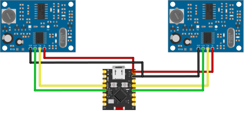

    
    <h1>Water Tank Level Sensor</h1>

 

## Ingredients

- ESP32-C3 Super Mini
- 2 x AJ-SR04M Ultrasonic sensors

## Description

This project uses two ultrasonic sensors to measure the water level in two tanks.
Adds for each tank a percentage value of how full the tank is.

## Resources

- [ESPHome Ultrasonic Sensor](https://esphome.io/components/sensor/ultrasonic/)
- [Gist Example](https://gist.github.com/peyanski/d64a17c4b8e5c23040e78ff6fcd1b9fb)
